class: highlight-last-item, center
```{r setup, include=FALSE}
options(htmltools.dir.version = FALSE)
knitr::opts_chunk$set(echo = FALSE, warning = FALSE, message = FALSE)
knitr::opts_chunk$set(fig.showtext = TRUE)
library(tidyverse)
library(DT)
```

```{r xaringan-themer, include=FALSE, warning=FALSE}
library(xaringanthemer)
style_duo(
  primary_color = "#035AA6",        # blue = "#035AA6"
  secondary_color = "#161872",      # dark blue = "#161872" ; dark green =　"#00470e" ; orange = "#e87205"
  text_color = "#242629",
  link_color = "#00470e",   # orange = "#e87205"   dark green =　"#00470e"
  text_bold_color = "#035AA6",      # blue = "#035AA6"  dark green =　"#00470e"
  background_color = "#FFFFFF",
  inverse_background_color = "#e1ebf4",
  inverse_text_color = "#242629",
  title_slide_text_color = "#161872",   # dark blue = "#161872"
  title_slide_background_color = "#e1ebf4",
  header_font_google = google_font("Crete Round"),
  text_font_google   = google_font("Crete Round"),
  code_font_google   = google_font("Fira Mono"),
  header_h1_font_size = "2rem",
  header_h2_font_size = "1.20rem",
  header_h3_font_size = "1 rem",
  base_font_size = "20px"
)
```
class:middle, center
```{css echo=FALSE}
.highlight-last-item > ul > li, 
.highlight-last-item > ol > li {
  opacity: 0.5;
}
.highlight-last-item > ul > li:last-of-type,
.highlight-last-item > ol > li:last-of-type {
  opacity: 1;
}
```


# Tri-border Areas and the Location of Economic Activity in Open Economies


## Felipe Santos-Marquez  & Christian Lessmann 


###Chair of International Economics
###Technische Universität Dresden

---
class: center
##On average, do border and non-border regions have the same level of economic activity?
--

<!--  -->
<!--  -->


Image taken from A am, H. L., Larch, M., & Stadelmann, D. (2021)

---
class: middle 

# Research question ->
# What is the causal effect of regional trade agreements among neighboring countries on the economic activity of areas near the international border?

---
# Related literature

## Trade and the location of economic activity


**Krugman, P. (1991)**, **Brülhart, M. (2011)**, **Hirte, G., Lessmann, C., & Seidel, A. (2020)**, **World Bank. (2008)**, **Combes, P. P., Mayer, T., & Thisse, J. F. (2008)**

"... the tendency for trade liberalisation to favour re-location towards border regions emerges as an almost ubiquitous result"  **Brülhart, M. (2011, p. 67)**


## Trade openness and international borders:

**McCallum, J. (1995)**,**Eberhard-Ruiz, A., & Moradi, A. (2019)**, **Brülhart, M., Cadot, O., & Himbert, A. (2019)**, **Adam, H. L., Larch, M., & Stadelmann, D. (2021)**

## Nighttime lights as a proxy for economic activity:

**Chen, X., & Nordhaus, W. D. (2011)**, **Henderson, J. V., Storeygard, A., & Weil, D. N. (2012)**, **Nordhaus, W., & Chen, X. (2015)**, **Lessmann, C., & Seidel, A. (2017)**

---
class: center
## What are tripoints? How many tripoints are there in the world?

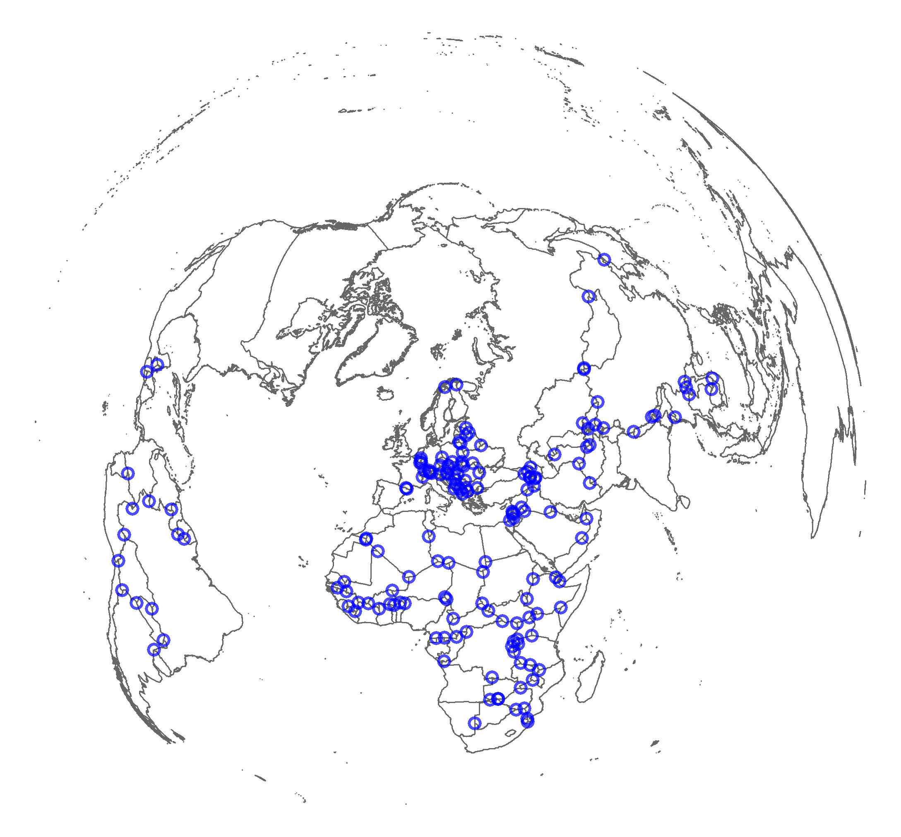


tri-border areas (also called tripoints, trijunctions, triple points)
---
class: center
## Identification Strategy ->

##Quasi random treatment: start of the ***first*** regional trade agreement in the triplet.

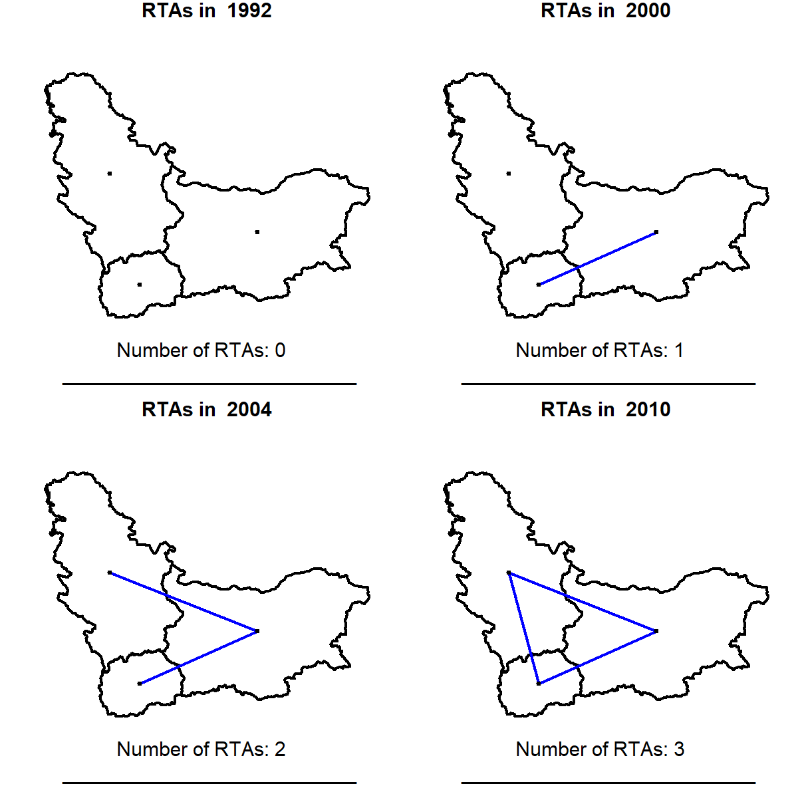

Data on RTAs taken from Mario Larch’s Regional Trade Agreements Database  Egger, P., & Larch, M. (2008) 
---
class: left

##Where is economic activity measured?

.pull-left[ ## Triplet of countries and several buffer area

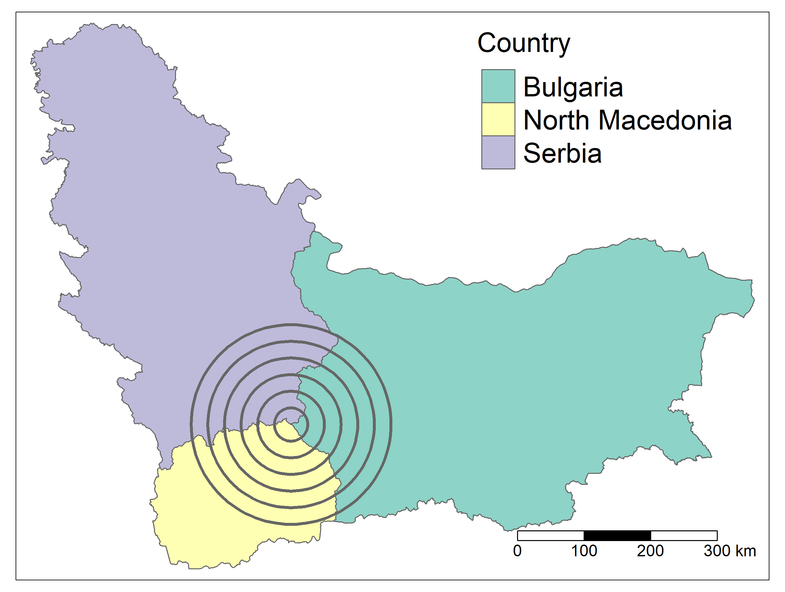
]

.pull-right[ ## closer view - radius of 75 kilometers


]


---
# How is economic activity measured?

.pull-left[ ## 1992

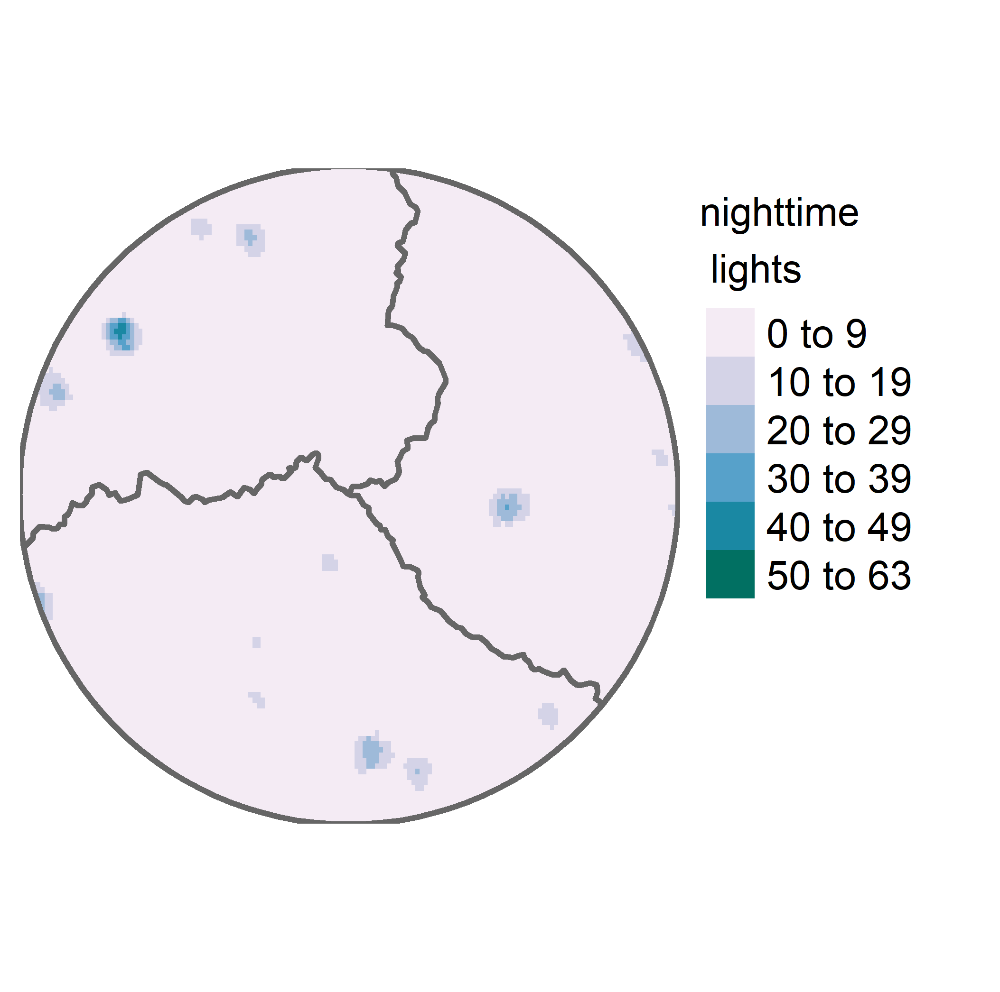

]

.pull-right[ ## 2005

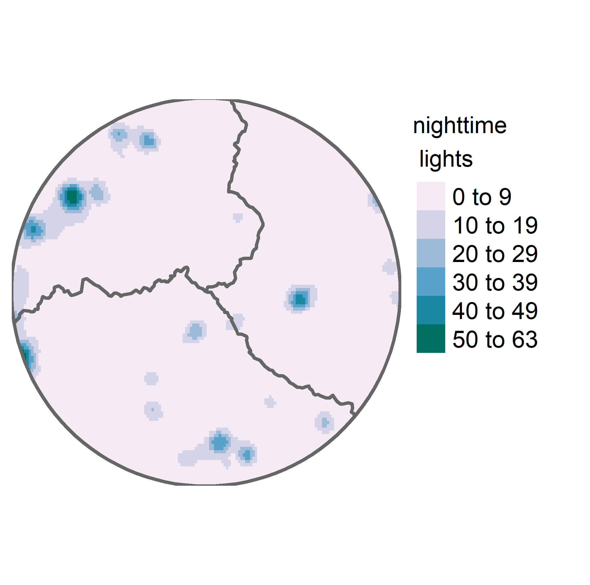
]

Raster of nighttime lights for one buffer area. Data taken from Li, X., Zhou, Y., Zhao, M., & Zhao, X. (2020)

---


class: center
# Final dataset of tripoints and RTAs

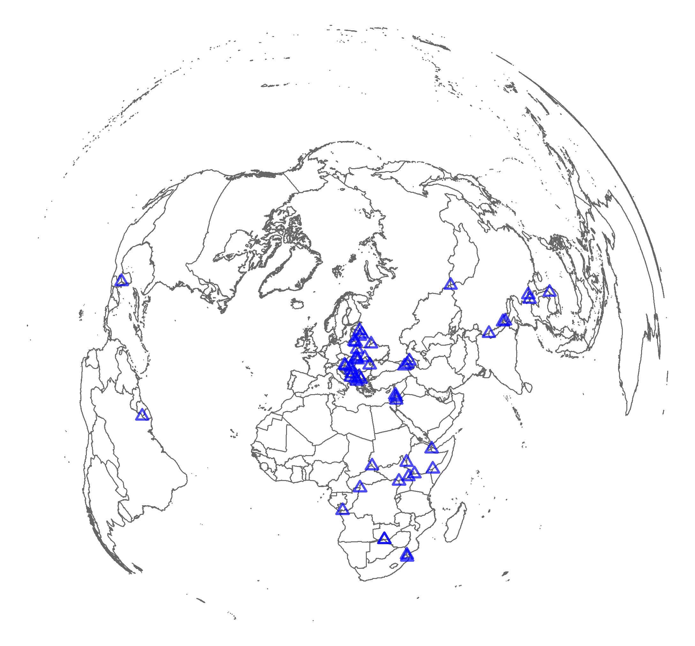

---

# Empirical Startegy: Difference-in-Differences

$$ln\, LIGHTS_{i j t}=\alpha_{0}+\alpha_{1} {RTA}_{ijt}+ FE +\varepsilon_{i jt}$$

.pull-left[
Where $LIGHTS_{i j t}$ is the sum of lights in the area of the country $i$, in triplet $j$ at time $t$, $R T A_{i j t}$ is a dummy variable which takes the value of 1 if region $i$ in triplet $j$ is part of a country which had a trade agreement (with other neighboring country in the triplet) in time $t$, FE are   country-triplet and year fixed effects, and $\varepsilon_{ijt}$ is an idiosyncratic error term.]

.pull-right[

```{r}
data <- tibble(
  Y = c(2, 5, 1, 2),
  Unit = c("Treat", "Treat", "Control", "Control"),
  T = c(0, 1, 0, 1)
)
data %>% 
  group_by(Unit) %>% 
  mutate(Y2 = Y - Y[which(T == 0)]) %>% 
  ggplot(aes(x = T, y = Y, group = Unit, color = Unit)) + 
  geom_line(size = 2) + 
  geom_line(aes(x = T, y = Y2, group = Unit, color = Unit), linetype = "dashed", size = 2) + 
  labs(x = "Time", y = "Outcome") + 
  scale_x_continuous(breaks = c(1, 2)) +
  scale_colour_brewer(palette = 'Set1') + 
  theme(axis.title = element_text(size = 20),
        axis.text = element_text(size = 20),
        legend.position = 'bottom',
        legend.title = element_blank(),
        legend.text = element_text(size = 20),
        plot.background = element_blank()) + 
  annotate("label", y = 2, x = 0.85, label = "Treatment \n Effect") + 
  annotate("segment", x = 1, xend = 1, y = 1, yend = 3, color = "black", size = 1) + 
  annotate("segment", x = 0.92, xend = 1, y = 2, yend = 3, color = "black", 
           linetype = "dashed", size = 2) + 
  annotate("segment", x = 0.92, xend = 1, y = 2, yend = 1, color = "black", 
           linetype = "dashed", size = 2) + 
  annotate("segment", x = 0, xend = 0, y = 2, yend = 0, color = "#377EB8", 
           arrow = arrow(length = unit(0.1, "inches")), size = 2) + 
  annotate("segment", x = 0.5, xend = 0.5, y = 1.5, yend = 0.5, color = "#E41A1C", 
           arrow = arrow(length = unit(0.1, "inches")), size = 2)
```
]
---

# Event-study Design

$$ln\, LIGHTS_{i j t}=\alpha_{0}+ \sum_{\tau=-q}^{-1}\gamma_{\tau}D_{ijt}^\tau + \sum_{\tau=1}^m\delta_{\tau}D_{ijt}^\tau+ FE +\varepsilon_{i jt}$$

.pull-left[
Where $LIGHTS_{i j t}$ is the sum of lights in the area of the country $i$, in triplet $j$ at time $t$. Treatment occurs at time 0 and we include q leads or anticipatory effects and m lags or post-treatment effects. FE are country-triplet and year fixed effects, and $\varepsilon_{ijt}$ is an idiosyncratic error term
]

.pull-right[
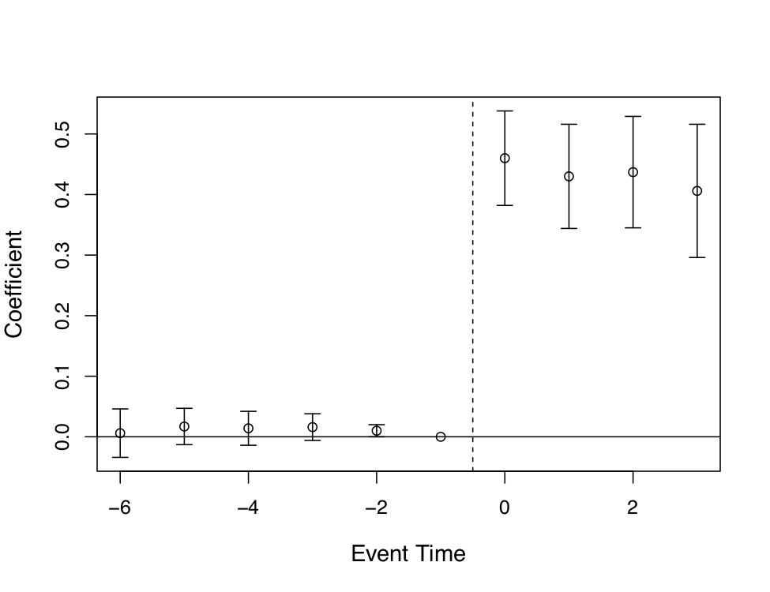

Example of a event study plot, image taken from Cunningham, S. (2021).

]

---
class: center 

#Results : Regression Estimates
.pull-left[##50 KM


Columns with odd numbers: clustered errors 


Columns with even numbers: standard errors
]
.pull-right[##25 KM

]

<!-- --- -->
<!-- class: center -->
<!--  -->
<!--  -->

<!-- --- -->
<!-- ## However... -->

<!-- 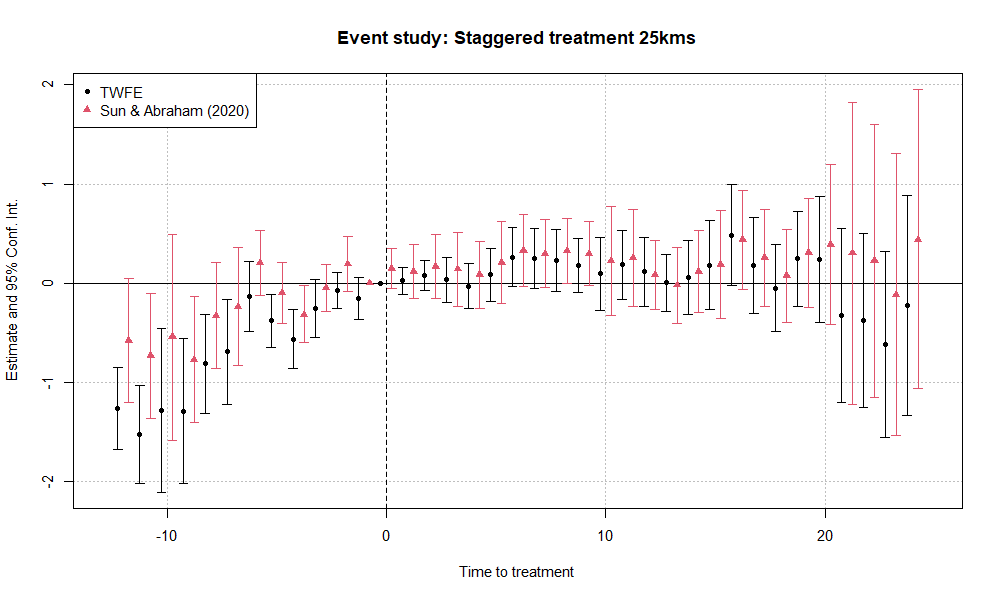 -->

<!-- mention parallel trends and no clear estimate of treatment coefficient -->

---
## However...


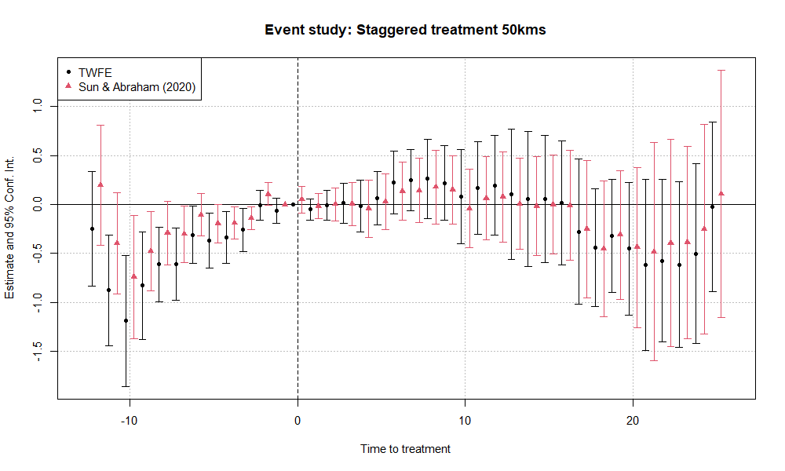

---

### Cities


.pull-left[ ### 1990

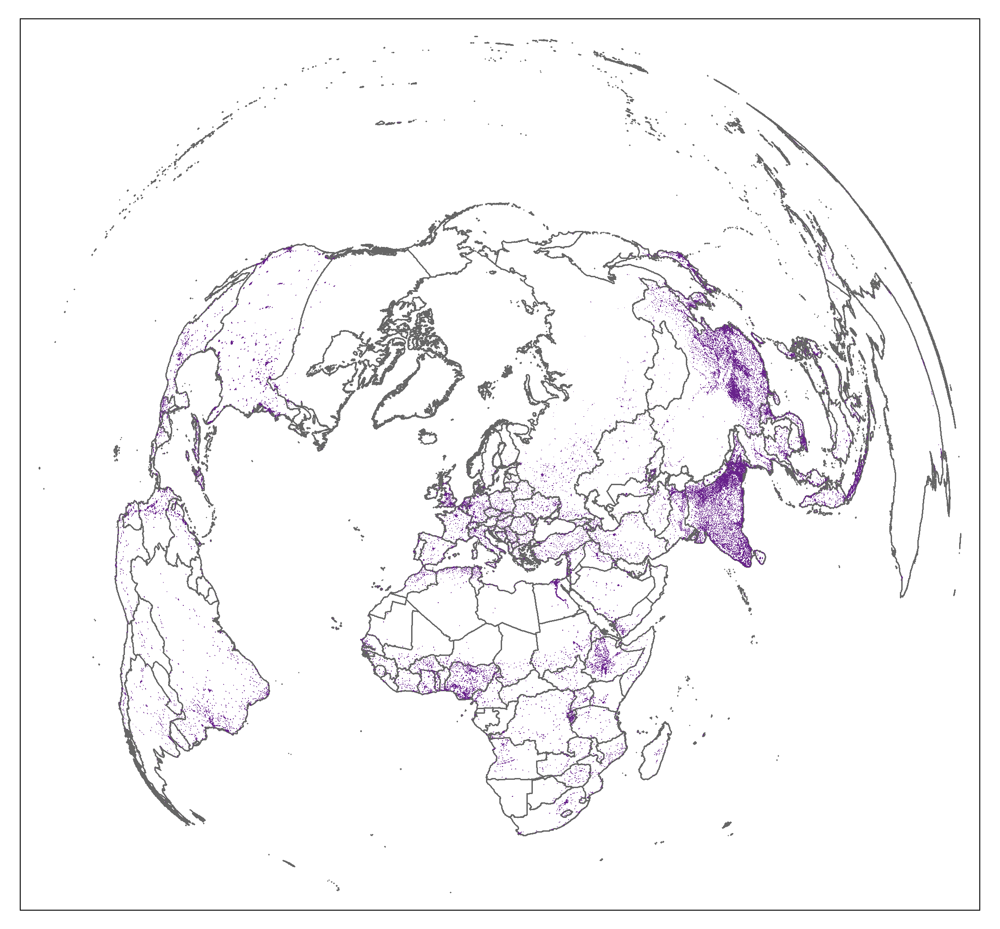
]

.pull-right[ ### 2015

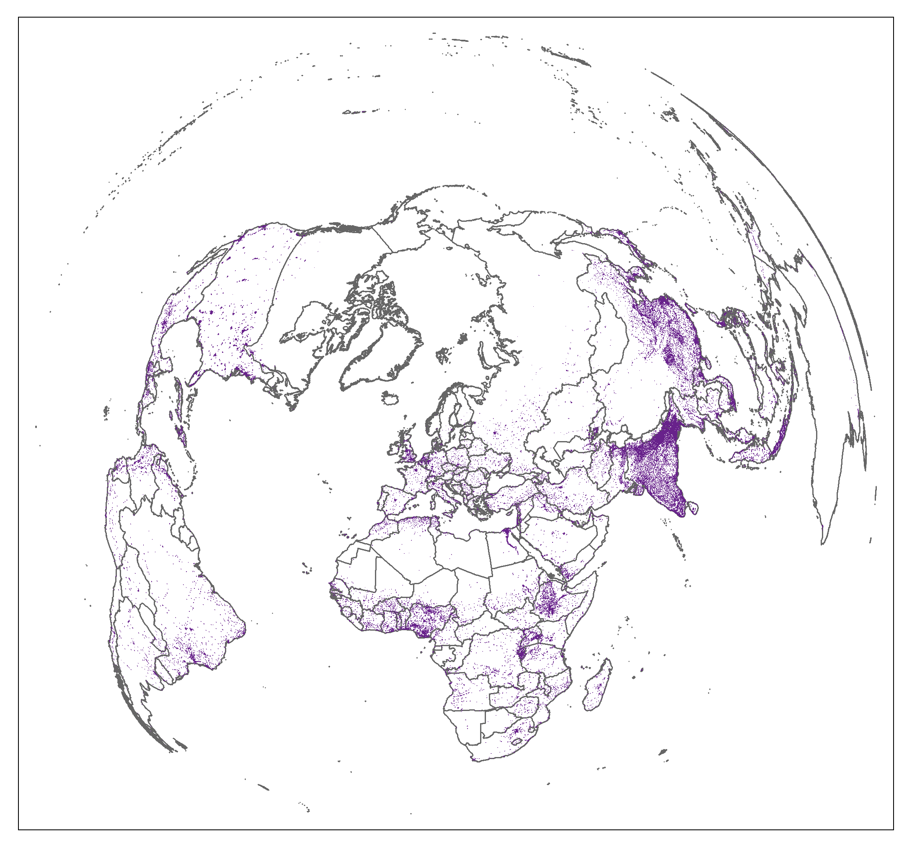
]


Data for the poygons of cities taken from Bluhm, et al. (2021). Number of cities in 1990 and 2015 is **24652** and **30675**.

---
class: center 

## A triplet of countries, cities and buffer areas

.pull-left[ ## City polygons in 1990


]

.pull-right[ ## City polygons in 2015

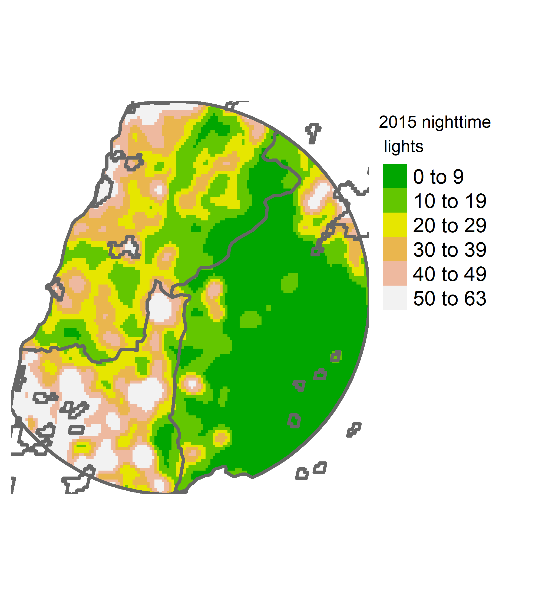
]


---
class: center

# Cities in 1990 
.pull-left[

]
.pull-right[
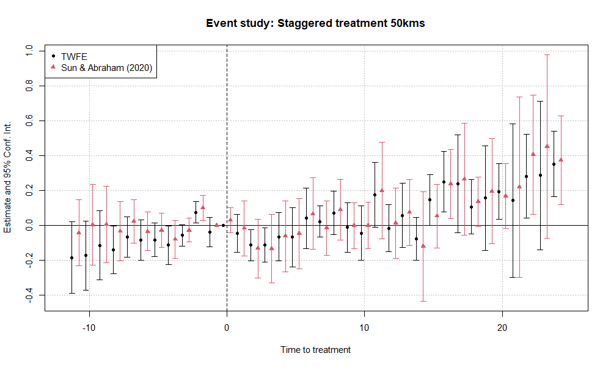

]


---
class: center


## Cities in 2015

.pull-left[

]
.pull-right[
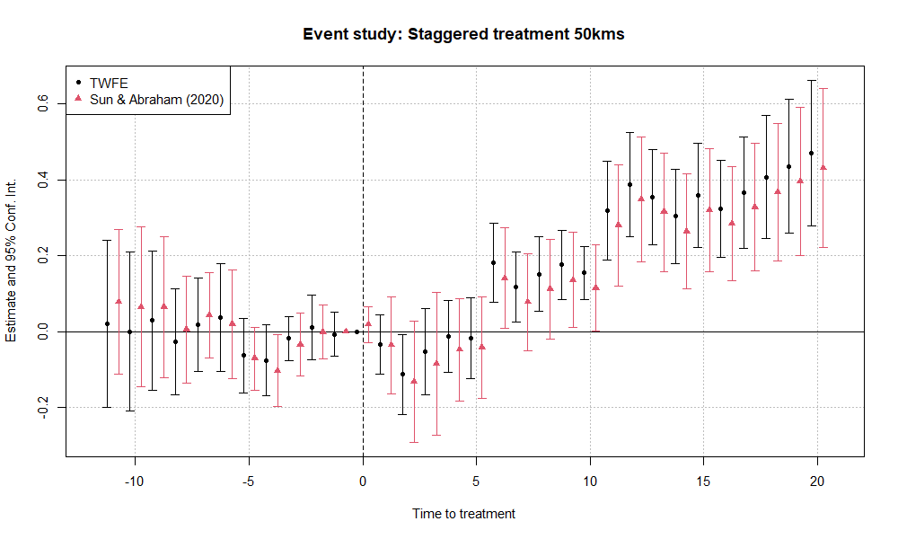

]


---
class: center


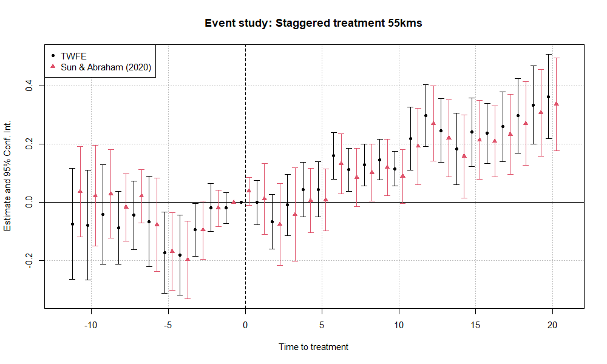

---
class: center


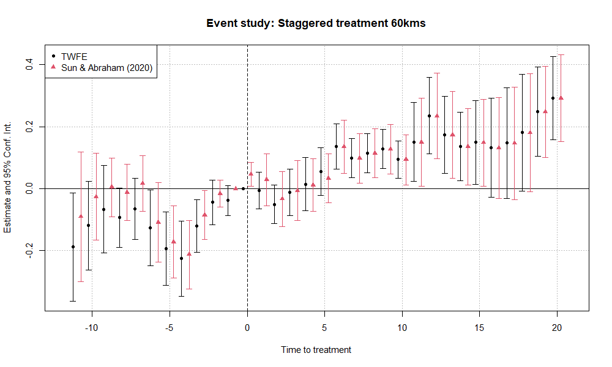


---
class: center

## location of tripoints 

.pull-left[**Original sample**

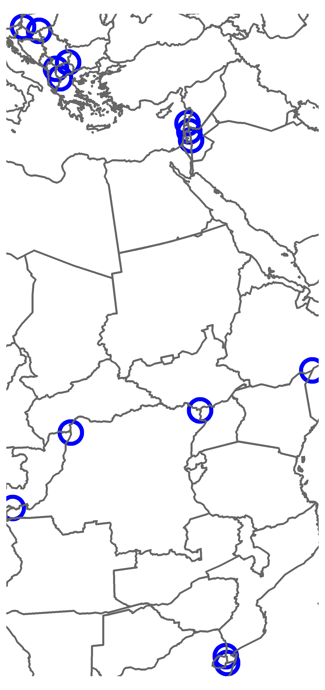]
.pull-right[**Restricted sample**

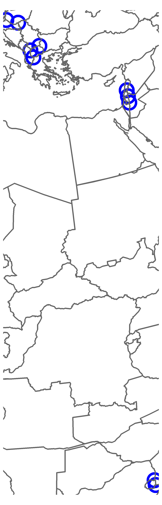]

<!-- --- -->

<!-- ## Event study plot - full dataset (60 kms radius) -->

<!-- 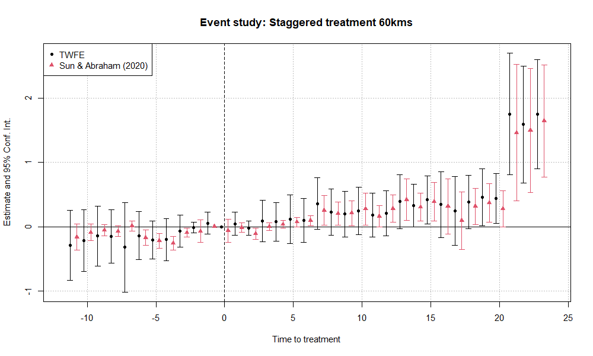 -->

---

# Conclusions:

- There is not a significant effect of RTAs on economic activity for buffer areas.
- There is not a significant effect of RTAs on economic activity for 1990 cities within buffer areas.
- The effect of RTAs on economic activity can be measured for 2015 cities.
- RTAs appear to be driving the agglomeration of output in cities/population growth of cities. 

# Further research: 

- Heterogeneous effects of RTAs for different geographical regions.
- The effects of different types of trade agreements on the light intensities at border regions.
<!-- - The datasets may be too small to consider  -->
- Robustness checks, another DID estimators **Goodman-Bacon, A. (2021)**, **Callaway, B., & Sant’Anna, P. H. (2021)**


---


## References


Adam, H. L., Larch, M., & Stadelmann, D. (2021). Subnational Income Growth and International Border Effects. SSRN Electronic Journal. https://doi.org/10.2139/ssrn.3863023

Bluhm, R., Lessmann, C., & Schaudt, P. (2021). The Political Geography of Cities. SSRN Electronic Journal, October. https://doi.org/10.2139/ssrn.3953012

Brülhart, M. (2011). The spatial effects of trade openness: a survey. Review of World Economics, 147(1), 59-83.

Brülhart, M., Cadot, O., & Himbert, A. (2019). Let There Be Light: Trade and the Development of Border Regions.

Callaway, B., & Sant’Anna, P. H. (2021). Difference-in-differences with multiple time periods. Journal of Econometrics, 225(2), 200-230.

Chen, X., & Nordhaus, W. D. (2011). Using luminosity data as a proxy for economic statistics. Proceedings of the National Academy of Sciences, 108(21), 8589-8594.

Combes, P. P., Mayer, T., & Thisse, J. F. (2008). Economic geography. In Economic Geography. Princeton University Press.

---

Cunningham, S. (2021). Causal inference. In Causal Inference. Yale University Press.

Eberhard-Ruiz, A., & Moradi, A. (2019). Regional market integration in East Africa: Local but no regional effects?. Journal of Development Economics, 140, 255-268.

Egger, P., & Larch, M. (2008). Interdependent preferential trade agreement memberships: An empirical analysis. Journal of International Economics, 76(2), 384-399. 


Goodman-Bacon, A. (2021). Difference-in-differences with variation in treatment timing. Journal of Econometrics, 225(2), 254-277.

Henderson, J. V., Storeygard, A., & Weil, D. N. (2012). Measuring economic growth from outer space. American economic review, 102(2), 994-1028.

Hirte, G., Lessmann, C., & Seidel, A. (2020). International trade, geographic heterogeneity and interregional inequality. European Economic Review, 127, 103427.

Krugman, P. (1991). Increasing returns and economic geography. Journal of political economy, 99(3), 483-499.

Lessmann, C., & Seidel, A. (2017). Regional inequality, convergence, and its determinants–A view from outer space. European Economic Review, 92, 110-132.

Li, X., Zhou, Y., Zhao, M., & Zhao, X. (2020). A harmonized global nighttime light dataset 1992–2018. Scientific Data, 7(1). https://doi.org/10.1038/s41597-020-0510-y

---

McCallum, J. (1995). National borders matter: Canada-US regional trade patterns. The American Economic Review, 85(3), 615-623.

Nordhaus, W., & Chen, X. (2015). A sharper image? Estimates of the precision of nighttime lights as a proxy for economic statistics. Journal of Economic Geography, 15(1), 217-246.

World Bank. (2008). World development report 2009: Reshaping economic geography. The World Bank.

---
class: middle, center

# When regions grow Solo(w): Neoclassical convergence and spatial filtering across Chinese provinces 

## Felipe Santos-Marquez, TU Dresden, Germany  
## Carlos Mendez, Nagoya University, Japan
## Linda Glawe, University of Hagen, Germany

---

## Motivation:

- The estimates from the augmented Solow growth model are biased since neighbor effects are not taken into account.
- There is limited research on the effect geographical links and convergence accounting across Chinese provinces.
  
## Research Question:
  
- **To what extent the role of space affects the convergence of Chinese regions?**
- **What are the contribution of capital inputs and productivity on the convergence of provincial income per capita?** 

## Methods:

Classical convergence framework (Barro and Sala-i-Martin, 1992) / Convergence growth accounting (Wong, 2007; Feyrer, 2007) /  Spatial autocorrelation - Moran's I (Moran, 1948) / Getis Filter (Getis, 1995, 2010)


---

# Outline


1. **Introduction and Data**

  - A newly constructed data-set

2. **Methods**

  - **Spatial autocorrelation** Standard Moran's I
  - **Spatial Filtering Perspective**  Getis Spatial Filter
  - **Convergence regression and accounting** 
 
3. **Related Literature**

4. **Results**

  - Spatial filtering
  - Spatial and non-spatial convergence accounting
  
4. **Concluding Remarks**


---

# (1) Data


###A balanced dataset for 31 provinces over the 1990-2017 period.

### **GDP per capita**. Real GDP in constant 2010 prices is calculated using GDP and CPI data from the National Bureau of Statistics of China (NBS, 2021).


### **Human capital**. The CHLR human capital index (cf. Fraumeni et al., 2019). 


### **Capital output ratio**. the current provincial physical capital stock divided by the current provincial GDP.


---
class: middle

# (2) Spatial Autocorrelation : 

##Moran's I

$$I = \frac{\sum_i\sum_j w_{ij} z_i.z_j}{\sum_i z_i^2} = \frac{\sum_i (z_i \times \sum_j w_{ij} z_j)}{\sum_i z_i^2}.$$
 It captures the relationship of a variable in one location with the spatially weighted average of values at neighboring locations.

 
 


---

# (2) Spatial Filtering Perspective

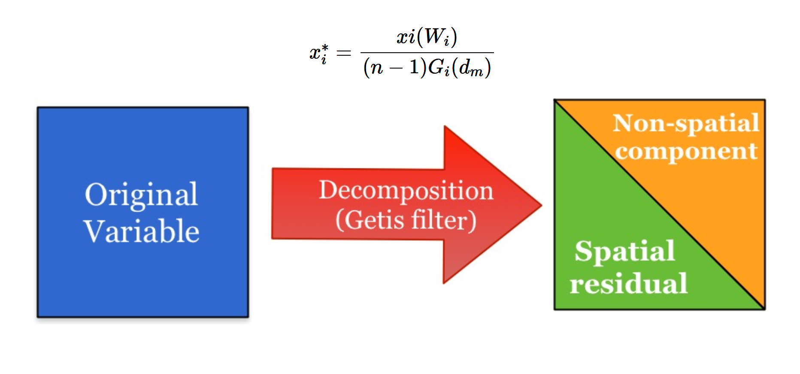
 
### **A spatial filtering of the data can help us to avoid misguided interpretation**.

---
class: center
# (2) Beta convergence


---
class: center
# (2) Growth accounting 


### Growth accounting decomposition based on Solow (1956):
\begin{equation} 
Y = \left( \frac{K}{Y} \right) ^{\frac{\alpha}{1-\alpha}}A h L.
\end{equation}

\begin{equation} \label{eq:linear-ss-pc-cobb}
\ln \left( \frac{Y}{L} \right) = \frac{\alpha}{1-\alpha} \ln \left( \frac{K}{Y} \right) + \ln (h) + \ln (A)
\end{equation}

### Taking derivatives with respect to time yields a growth accounting decomposition:
\begin{equation}
g \left( \frac{Y}{L} \right) = \frac{\alpha}{1-\alpha} g \left( \frac{K}{Y} \right) + g(h) +g(A),
\end{equation}

### We can write this equation as:

\begin{equation} \label{eq:growth-acc-simple}
g (y) = g(k) + g(h) +g(A),
\end{equation}

---
class: center
# (2) Convergence accounting 

### The standard unconditional beta convergence regression is:


$$g (y)= c + \beta \ln (y_{t 0}) + \epsilon$$

### From the last equation in the previous slide it can be shown that:

$$\beta = \beta_{k}+\beta_{h}+\beta_{A}$$

### where the $\beta_i$ coefficients are obtained from the following regressions


$$g(k)=c_{k}+\beta_{k} \ln (y_{t 0}) + \epsilon$$   

$$g(h)=c_{h}+\beta_{h} \ln (y_{t 0}) + \epsilon$$  

$$g(A)=c_{A}+\beta_{A} \ln (y_{t 0}) + \epsilon$$   

---
class: center
# (2)  Spatial Convergence accounting

In the context of our production function, let us define the log of the net spatial residual  as: 
$$\ln \left( \frac{Y}{L} \right) = \frac{\alpha}{1-\alpha} \ln \widetilde{\left( \frac{K}{Y} \right)} + \ln (\widetilde{h}) + \ln (\widetilde{A}) + \ln (NSR)$$
which implies: 
$$g (y) = g(\widetilde{k}) + g(\widetilde{h}) + g(\widetilde{A}) + g(NSR)\Longrightarrow\beta = \beta_{\tilde{k}} + \beta_{\tilde{h}} + \beta_{\tilde{A}} + \beta_{NSR}$$


where the $\beta_i$ coefficients are obtained from the following regressions

$$g(\tilde{k})=c_{\tilde{k}}+\beta_{\tilde{k}} \ln (y_{t 0}) + \epsilon$$

$$g(\tilde{h})=c_{h}+\beta_{\tilde{h}} \ln (y_{t 0}) + \epsilon$$

$$g(\tilde{A})=c_{\tilde{A}}+\beta_{\tilde{A}} \ln (y_{t 0}) + \epsilon$$

$$g(NSR)=c_{NSR}+\beta_{NSR} \ln (y_{t 0}) + \epsilon$$

---
# (2) Related literature

### Convergence of Chinese provinces 

- **Chen and Fleisher (1996)** there are no
signs of unconditional convergence for the sample period 1952-1992.
Nevertheless, for the most recent period of 1978-1993 they find weak
evidence of unconditional convergence. 
- **Raiser (1998)**  The author uses data for 29
provinces for the period 1978-1992. He reports that overall provincial income levels have converged. Nevertheless, a major slow-down in the
convergence speed was reported in the second half of the 1980s. 
-  **Weeks and Yao (2003)** . The authors use the system-GMM
estimator and report a very slow convergence speed (0.41%) during the pre- reform period 1953–1977 and a much faster speed (2.23%) during the reform period 1978–1997.

### Convergence and spatial filtering 

-  Europe (Fischer and Stumpner, 2010),  Brazil (Cravo and Resende, 2013) 
- Indonesia (Santos-Marquez et al., 2022),  Spain (Maza and Villaverde, 2009) 
- **China** by **Villaverde and Maza
(2012)**,  Chinese provincial GDP per capita in 1992-2007. they use a different convergence framework known as distribution dynamics. 

---
class: center

# (3) Results: Spatial filtering

Spatial autocorrelation for A, K/Y , h and Y /L is continuously significant from 1998 to 2010

 

---
class: center 

# (3) Results: Spatial filtering


.pull-left[

##(a) 1998
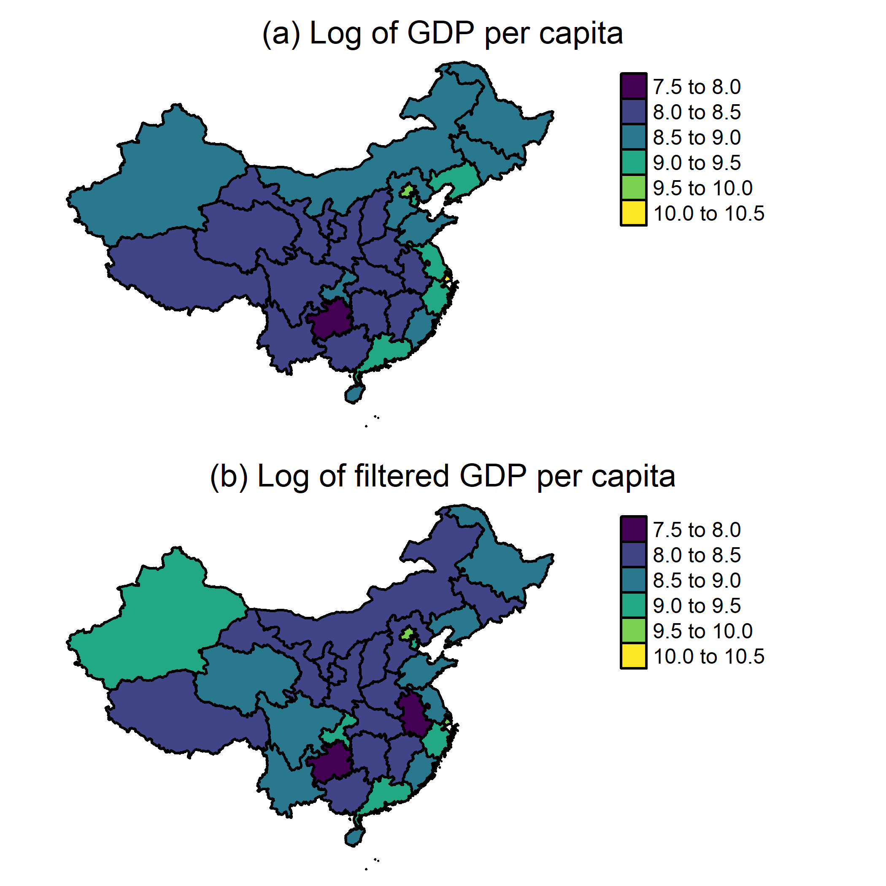
]

.pull-right[

##(b) 2010
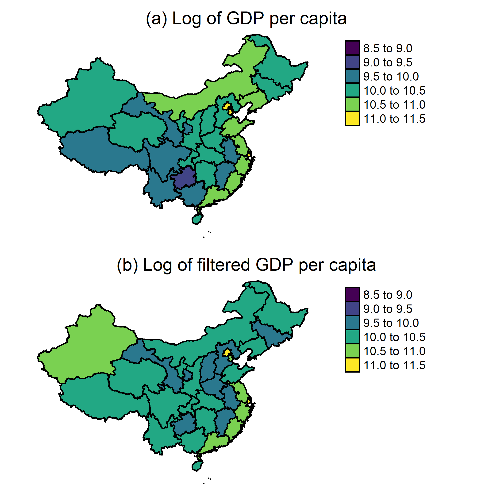
]

---
# (3) Results: beta convergence

### There is overall unconditional convergence in provincial GDP per capita

.pull-left[

##**Original data**


]

.pull-right[

##**Filtered data**


]

---
class: center
# (3) Results: spatial and non-spatial convergence accounting


 

---
# (6) Concluding Remarks


- ###Convergence of TFP explains most of the convergence of regional income. 
- ### The convergence of capital inputs account for about 30% of income covergence.
- ### Spatial effects are reducing the regional income disparities.

## Implications 

- To spatially filter regional income and other variables is important in order to avoid misleading interpretations.
- Geography matters! breaking spatial barriers and  continuing to enhance inter-regional connectivity and cooperation must be on top of the policy agenda.

---
# (6) Next steps

- ### Review a more extensive list of papers that analyse regional convergence in China.
- ### Select the appropriate $\alpha$ in the growth equation.
- ### Document and improve the Getis filter function. We would like to have as one of the outputs of this paper a function that can be part of a package for spatial analysis in R. 
- ### Compare the results of this project with the results reported in previous papers.

---

---
class: center, middle

# Thank you very much for your attention
<!-- personal website: https://felipe-santos.rbind.io -->


.pull-left[


**Quantitative Regional and Computational Science lab**


https://quarcs-lab.org

]

.pull-right[


**Chair of International Economics
Technische Universität Dresden
Germany**

https://tu-dresden.de/bu/wirtschaft/vwl/iwb 
]


