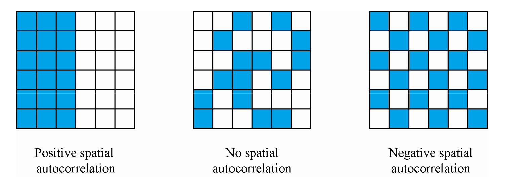
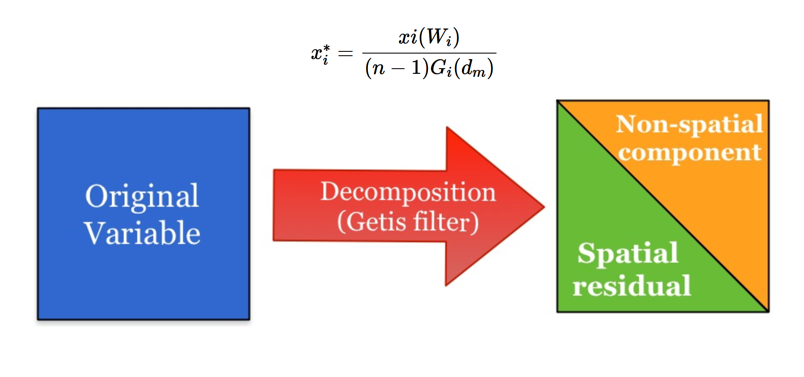
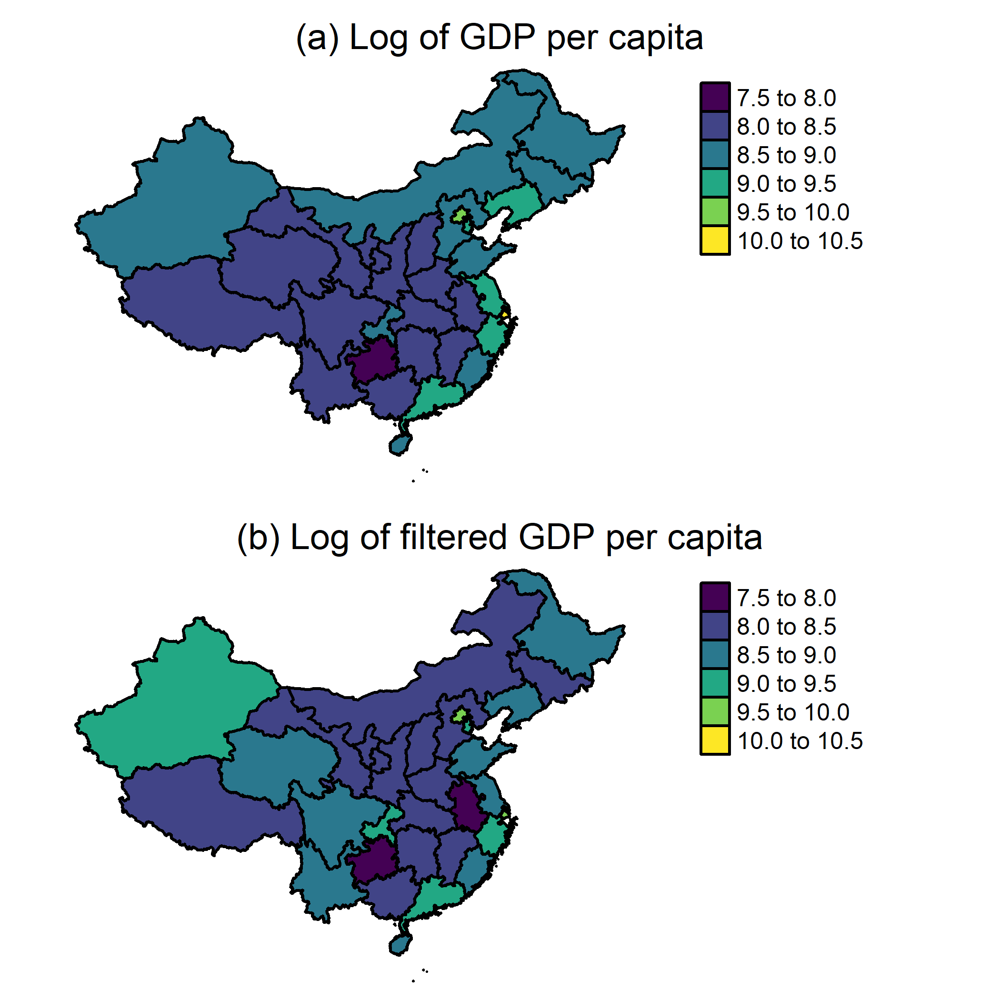
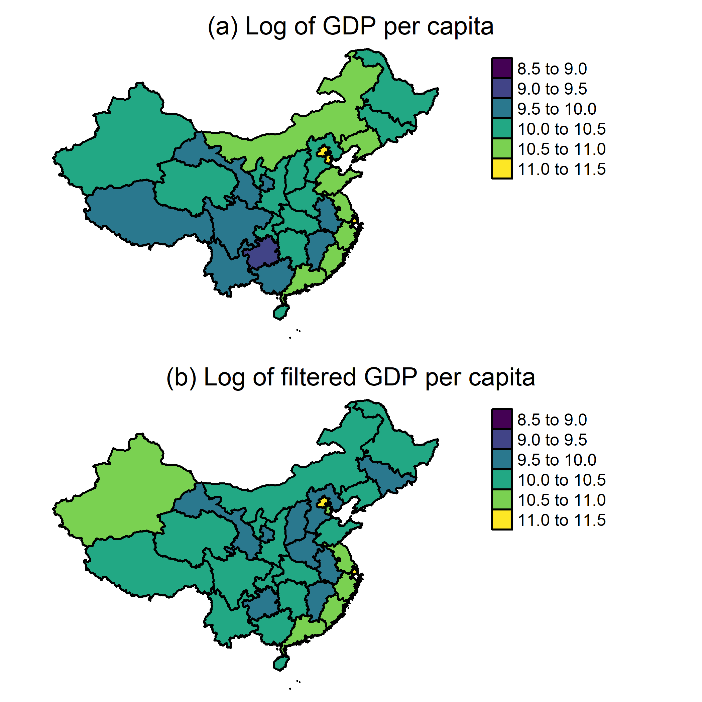

```{r setup, include=FALSE}
library(xaringan)
options(htmltools.dir.version = FALSE)
```

## Motivation:

- The estimates from the augmented Solow growth model are biased since neighbor effects are not taken into account.
- There is limited research on the effect geographical links and convergence accounting across Chinese provinces.
  
## Research Question:
  
- **To what extent the role of space affects the convergence of Chinese regions?**
- **What are the contribution of capital inputs and productivity on the convergence of provincial income per capita?** 

## Methods:

Classical convergence framework (Barro and Sala-i-Martin, 1992) / Convergence growth accounting (Wong, 2007; Feyrer, 2007) /  Spatial autocorrelation - Moran's I (Moran, 1948) / Getis Filter (Getis, 1995, 2010)


---

# Outline


1. **Introduction and Data**

  - A newly constructed data-set

2. **Methods**

  - **Spatial autocorrelation** Standard Moran's I
  - **Spatial Filtering Perspective**  Getis Spatial Filter
  - **Convergence regression and accounting** 
 
3. **Related Literature**

4. **Results**

  - Spatial filtering
  - Spatial and non-spatial convergence accounting
  
4. **Concluding Remarks**


---

# (1) Data


###A balanced dataset for 31 provinces over the 1990-2017 period.

### **GDP per capita**. Real GDP in constant 2010 prices is calculated using GDP and CPI data from the National Bureau of Statistics of China (NBS, 2021).


### **Human capital**. The CHLR human capital index (cf. Fraumeni et al., 2019). 


### **Capital output ratio**. the current provincial physical capital stock divided by the current provincial GDP.


---
class: middle

# (2) Spatial Autocorrelation : 

##Moran's I

$$I = \frac{\sum_i\sum_j w_{ij} z_i.z_j}{\sum_i z_i^2} = \frac{\sum_i (z_i \times \sum_j w_{ij} z_j)}{\sum_i z_i^2}.$$
 It captures the relationship of a variable in one location with the spatially weighted average of values at neighboring locations.

 
 


---

# (2) Spatial Filtering Perspective


 
### **A spatial filtering of the data can help us to avoid misguided interpretation**.

---
class: center
# (2) Beta convergence


---
class: center
# (2) Growth accounting 


### Growth accounting decomposition based on Solow (1956):
\begin{equation} 
Y = \left( \frac{K}{Y} \right) ^{\frac{\alpha}{1-\alpha}}A h L.
\end{equation}

\begin{equation} \label{eq:linear-ss-pc-cobb}
\ln \left( \frac{Y}{L} \right) = \frac{\alpha}{1-\alpha} \ln \left( \frac{K}{Y} \right) + \ln (h) + \ln (A)
\end{equation}

### Taking derivatives with respect to time yields a growth accounting decomposition:
\begin{equation}
g \left( \frac{Y}{L} \right) = \frac{\alpha}{1-\alpha} g \left( \frac{K}{Y} \right) + g(h) +g(A),
\end{equation}

### We can write this equation as:

\begin{equation} \label{eq:growth-acc-simple}
g (y) = g(k) + g(h) +g(A),
\end{equation}

---
class: center
# (2) Convergence accounting 

### The standard unconditional beta convergence regression is:


$$g (y)= c + \beta \ln (y_{t 0}) + \epsilon$$

### From the last equation in the previous slide it can be shown that:

$$\beta = \beta_{k}+\beta_{h}+\beta_{A}$$

### where the $\beta_i$ coefficients are obtained from the following regressions


$$g(k)=c_{k}+\beta_{k} \ln (y_{t 0}) + \epsilon$$   

$$g(h)=c_{h}+\beta_{h} \ln (y_{t 0}) + \epsilon$$  

$$g(A)=c_{A}+\beta_{A} \ln (y_{t 0}) + \epsilon$$   

---
class: center
# (2)  Spatial Convergence accounting

In the context of our production function, let us define the log of the net spatial residual  as: 
$$\ln \left( \frac{Y}{L} \right) = \frac{\alpha}{1-\alpha} \ln \widetilde{\left( \frac{K}{Y} \right)} + \ln (\widetilde{h}) + \ln (\widetilde{A}) + \ln (NSR)$$
which implies: 
$$g (y) = g(\widetilde{k}) + g(\widetilde{h}) + g(\widetilde{A}) + g(NSR)\Longrightarrow\beta = \beta_{\tilde{k}} + \beta_{\tilde{h}} + \beta_{\tilde{A}} + \beta_{NSR}$$


where the $\beta_i$ coefficients are obtained from the following regressions

$$g(\tilde{k})=c_{\tilde{k}}+\beta_{\tilde{k}} \ln (y_{t 0}) + \epsilon$$

$$g(\tilde{h})=c_{h}+\beta_{\tilde{h}} \ln (y_{t 0}) + \epsilon$$

$$g(\tilde{A})=c_{\tilde{A}}+\beta_{\tilde{A}} \ln (y_{t 0}) + \epsilon$$

$$g(NSR)=c_{NSR}+\beta_{NSR} \ln (y_{t 0}) + \epsilon$$

---
# (2) Related literature

### Convergence of Chinese provinces 

- **Chen and Fleisher (1996)** there are no
signs of unconditional convergence for the sample period 1952-1992.
Nevertheless, for the most recent period of 1978-1993 they find weak
evidence of unconditional convergence. 
- **Raiser (1998)**  The author uses data for 29
provinces for the period 1978-1992. He reports that overall provincial income levels have converged. Nevertheless, a major slow-down in the
convergence speed was reported in the second half of the 1980s. 
-  **Weeks and Yao (2003)** . The authors use the system-GMM
estimator and report a very slow convergence speed (0.41%) during the pre- reform period 1953–1977 and a much faster speed (2.23%) during the reform period 1978–1997.

### Convergence and spatial filtering 

-  Europe (Fischer and Stumpner, 2010),  Brazil (Cravo and Resende, 2013) 
- Indonesia (Santos-Marquez et al., 2022),  Spain (Maza and Villaverde, 2009) 
- **China** by **Villaverde and Maza
(2012)**,  Chinese provincial GDP per capita in 1992-2007. they use a different convergence framework known as distribution dynamics. 

---
class: center

# (3) Results: Spatial filtering

Spatial autocorrelation for A, K/Y , h and Y /L is continuously significant from 1998 to 2010

 

---
class: center 

# (3) Results: Spatial filtering


.pull-left[

##(a) 1998

]

.pull-right[

##(b) 2010

]

---
# (3) Results: beta convergence

### There is overall unconditional convergence in provincial GDP per capita

.pull-left[

##**Original data**


]

.pull-right[

##**Filtered data**


]

---
class: center
# (3) Results: spatial and non-spatial convergence accounting


 

---
# (6) Concluding Remarks


- ###Convergence of TFP explains most of the convergence of regional income. 
- ### The convergence of capital inputs account for about 30% of income covergence.
- ### Spatial effects are reducing the regional income disparities.

## Implications 

- To spatially filter regional income and other variables is important in order to avoid misleading interpretations.
- Geography matters! breaking spatial barriers and  continuing to enhance inter-regional connectivity and cooperation must be on top of the policy agenda.

---
# (6) Next steps

- ### Review a more extensive list of papers that analyse regional convergence in China.
- ### Select the appropriate $\alpha$ in the growth equation.
- ### Document and improve the Getis filter function. We would like to have as one of the outputs of this paper a function that can be part of a package for spatial analysis in R. 
- ### Compare the results of this project with the results reported in previous papers.


---
class: center

# Thank you very much for your attention!

### personal website: https://felipe-santos.rbind.io 


<br />

.pull-left[


**Quantitative Regional and Computational Science lab**


https://quarcs-lab.org

]

.pull-right[


**Chair of International Economics,
Technische Universität Dresden,
Germany**

https://tu-dresden.de/bu/wirtschaft/vwl/iwb 
]


